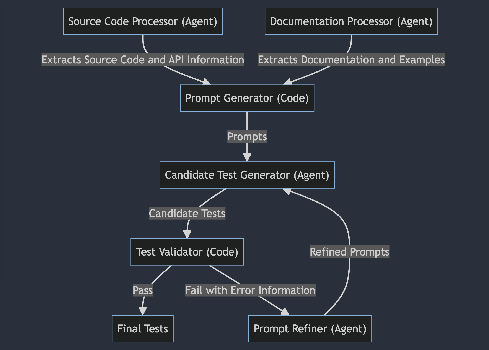

OAI Test Generator
========================

Introduction
------------

This project aims to automate the generation of unit tests using Large Language Models (LLMs) and Retrieval-Augmented Generation (RAG). The system processes source code and documentation to generate relevant test cases, which are then validated and refined.


## Software Architecture

The following diagram illustrates the architecture of the Automated Test Generator. Each component has a specific role in the process of generating and validating unit tests.



### Explanation of "Agent" and "Code"

- **Agent**: Refers to components that utilize a language model (LLM) to perform tasks. These agents rely on AI to process information, generate content, or refine inputs based on learned data.
- **Code**: Refers to traditional programming logic implemented to handle specific tasks without relying on AI. These components use standard algorithms and logic to process data and validate outputs.

### Components

1. **Source Code Processor (Agent)**:
    - **Function**: Extracts source code and API information.
    - **Details**: Parses the source code to identify functions and classes, generating a query based on the extracted API information.

2. **Documentation Processor (Agent)**:
    - **Function**: Extracts documentation and examples.
    - **Details**: Loads and splits documentation into manageable chunks, embedding and storing these chunks for efficient retrieval.

3. **Prompt Generator (Code)**:
    - **Function**: Generates prompts.
    - **Details**: Creates prompts for the language model based on the extracted API and documentation information.

4. **Candidate Test Generator (Agent)**:
    - **Function**: Generates candidate test cases.
    - **Details**: Uses the language model to generate candidate test cases from the provided prompts and relevant documentation chunks.

5. **Test Validator (Code)**:
    - **Function**: Validates candidate tests.
    - **Details**: Executes the generated candidate test cases to determine their validity.

6. **Prompt Refiner (Agent)**:
    - **Function**: Refines prompts based on feedback.
    - **Details**: Refines the prompts based on the validation feedback, regenerating test cases if necessary.

### Workflow

1. The **Source Code Processor** extracts functions and classes from the source code and generates a query.
2. The **Documentation Processor** prepares the document store by embedding documentation chunks and retrieves relevant chunks based on the query.
3. The **Prompt Generator** creates prompts using the extracted API information and relevant documentation chunks.
4. The **Candidate Test Generator** uses the prompts to generate candidate test cases.
5. The **Test Validator** runs the candidate test cases to validate their correctness.
6. If tests fail, the **Prompt Refiner** refines the prompts based on the validation feedback, and the **Candidate Test Generator** regenerates the tests.
7. Successful tests are saved as final tests.

How to Run the Project
----------------------

### Step 1: Install Dependencies

Ensure you have Python in your local/virtual environment installed. Then, install the necessary dependencies using pip:

`pip install -r requirements.txt`

### Step 2: Set Up Your API Key

Obtain an API key from your preferred LLM provider (OpenAI, Hugging Face, Cohere, etc.). Replace `"your_openai_api_key"` in the `main.py` with your actual API key.

### Step 3: Prepare Data

Place your source code files in `data/source_code/` and your documentation files in `data/documentation/`.

### Step 4: Run the Main Script

Execute the main script to generate and validate test cases:

`python automated_test_generator/core/main.py`

### Expected Output

After running the script, you should see output files in the `outputs/final_tests/` directory containing the generated and validated test cases.

Background Knowledge
--------------------

### Large Language Models (LLMs)

LLMs, such as OpenAI's GPT-3, are powerful AI models trained on vast amounts of text data. They can generate human-like text and understand natural language queries, making them suitable for various tasks, including text generation, summarization, and question-answering.
```python
    import openai

    openai.api_key = 'your_api_key'

    response = openai.Completion.create(
    engine="text-davinci-003",
    prompt="What is the capital of France?",
    max_tokens=5
    )

    print(response.choices[0].text.strip())
```      

### Retrieval-Augmented Generation (RAG)

RAG combines the strengths of information retrieval and text generation. It first retrieves relevant documents or chunks of text related to a query and then uses a language model to generate responses based on the retrieved information. This approach enhances the relevance and accuracy of generated text, especially for knowledge-intensive tasks.
```python
    import openai

    openai.api_key = 'your_api_key'

    # Retrieve relevant documents (mock example)
    documents = [
        "Paris is the capital and most populous city of France.",
        "France is a country whose territory consists of metropolitan France in Western Europe."
    ]

    # Create a prompt with the retrieved documents
    query = "What is the capital of France?"
    combined_docs = " ".join(documents)
    prompt = f"Context: {combined_docs}\n\nQuestion: {query}\nAnswer:"

    response = openai.Completion.create(
    engine="text-davinci-003",
    prompt=prompt,
    max_tokens=50
    )

    print(response.choices[0].text.strip())
```      

In this project, RAG is used to retrieve relevant documentation chunks to help generate accurate unit tests.

Project Goals
-------------

The primary goal of this project is to automate the generation of unit tests for a given codebase. Below are the detailed functionalities to be completed, including TODOs for further implementation:

*   **Source Code Processing:**
    *   Extract functions and classes from the source code.
    *   Generate a query based on the extracted API information.
    *   **TODO:** Implement `_extract_functions` to accurately parse and extract function details.
    *   **TODO:** Implement `_extract_classes` to accurately parse and extract class details.
*   **Documentation Processing:**
    *   Load and split documentation into manageable chunks.
    *   Embed and store documentation chunks for efficient retrieval.
    *   Retrieve relevant chunks based on a query.
    *   **TODO:** Improve the relevance of document chunk retrieval.
    *   **TODO:** Handle different documentation formats more robustly.
*   **Prompt Generation:**
    *   Create prompts for the language model based on API and documentation information.
    *   **TODO:** Enhance prompt templates to better capture edge cases and complex scenarios.
*   **Candidate Test Generation:**
    *   Use the language model to generate candidate test cases from prompts and documentation chunks.
    *   **TODO:** Refine the prompt-to-test generation logic to increase the accuracy and relevance of generated tests.
*   **Test Validation:**
    *   Execute candidate test cases to determine their validity.
    *   **TODO:** Integrate with more test frameworks (e.g., unittest, pytest) to broaden compatibility.
*   **Prompt Refinement:**
    *   Refine prompts based on validation feedback and re-generate test cases if necessary.
    *   **TODO:** Develop more sophisticated refinement strategies to handle various types of test failures.

By achieving these functionalities, the project aims to streamline the creation of comprehensive and accurate unit tests, ultimately enhancing the quality and reliability of the software development process.

Code Structure and Explanation
------------------------------

*   `agents/source_code_processor.py`: Responsible for parsing the source code and extracting API information.
*   `agents/documentation_processor.py`: Handles parsing of documentation (PDF and Markdown) to extract comments and example code, and stores document chunks in a vector store.
*   `agents/candidate_test_generator.py`: Generates candidate test cases using LLM based on prompts and document chunks.
*   `agents/prompt_refiner.py`: Refines prompts based on feedback from test validation.
*   `core/prompt_generator.py`: Generates prompts based on extracted API and documentation information.
*   `core/test_validator.py`: Validates the candidate test cases by running them through a test framework.
*   `core/main.py`: Main script that orchestrates the entire process from source code and documentation processing to test generation and validation.

Further Reading
---------------

*   [OpenAI GPT-3](https://beta.openai.com/)
*   [Hugging Face Transformers](https://huggingface.co/transformers/)
*   [Retrieval-Augmented Generation (RAG) Paper](https://arxiv.org/abs/2005.11401)
